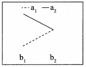
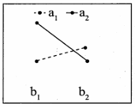
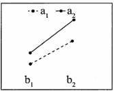
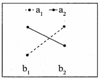
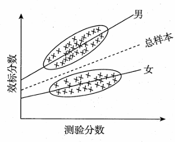
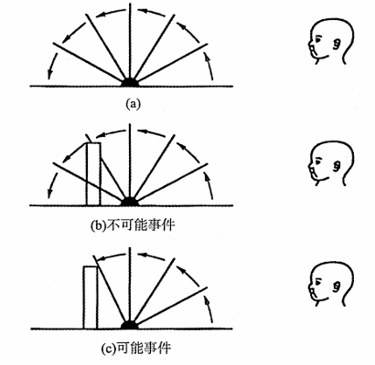

一、单项选择题:1~60小题,每小题2分,共120分。下列每题给出的四个选项中,只有一个选项是最符合题目要求的。 

1. 下列问题中,认知心理学家最有可能关注的是( ) A. 如何帮助人们处理家庭关系 B. 如何改进教学方法以提高教学效果 C. 如何理解书面语言 D. 如何提高员工的积极性 

2. 在安静的房间里,小华能听到6米外钟表秒针的滴答声,而小明却不能。说明小华比小明具有更高的( ) A. 绝对感觉阈 B. 绝对感受性 C. 差别感觉阈 D. 差别感受性 

3. 一个视觉正常的人,在注视一朵红花一分钟后,将眼睛看向白墙,此时看到的花是( ) A. 红色 B. 绿色 C. 蓝色 D. 黄色 

4. 下列能解释5000Hz以上音高的理论是( ) A. 频率理论 B. 位置理论 C. 神经齐射 D. 共同作用说 

5. 当彩色霓虹灯按一定顺序运动时,你可以看到变化。可以用来解释这种现象的是( ) A. 运动后效 B. 诱发运动 C. 自主运动 D. 动景运动 

6. 关于冥想,下面观点错误的是( ) A. 练习冥想可以有效提高人的身心健康水平 B. 是正念,冥想时要把全身心专注在当前的状态之下 C. 中国古代的“心斋”和“坐忘”都是冥想的形式 D. 正念冥想时,要对当前的状态好坏进行评判  *(注：已根据语境修正OCR乱码)*

7. 下列关于催眠的说法,正确的是( ) A. 催眠与睡眠是完全相同的意识状态 B. 催眠与睡眠状态的脑电波完全相同 C. 催眠源于奥地利医生的麦斯麦术 D. 催眠状态下被催眠者对暗示的反应会降低 

8. 洛夫特斯等人对目击者证词的研究主要表明( ) A. 记忆错误受个体年龄影响 B. 记忆错误受情绪差异影响 C. 记忆不受事后情况影响 D. 记忆主要是对过去事物进行建构的过程 

9. 关于内隐记忆和外显记忆影响因素说法正确的是( ) A. 加工深度影响内隐记忆大于外显记忆 B. 干扰信息影响内隐记忆大于外显记忆 C. 记忆负荷量影响外显记忆大于内隐记忆  *(注：已结合原意补全缺失的“记忆负”字眼)*
D. 呈现方式影响外显记忆大于内隐记忆 

10. 陆钦斯的定量容器实验反映了影响问题解决的因素是( ) A. 动机 B. 定势 C. 功能固着 D. 表征形式 

11. 根据概念组织的扩散模型,概念组织的基础是( ) A. 原型类比 B. 定势逻辑关系 C. 层次网络 D. 语义相关性 

12. 提出语言的先天获得装置的学者是( ) A. 布洛卡 B. 沃尔夫 C. 乔姆斯基 D. 威尔尼克 

13. 判断下列两个字(分别是A和B),判断A为假字的反应时比判断B为假字的反应时更短,这反映的影响汉字识别的因素是( ) A. 汉字的语音 B. 汉字的意义 C. 部位的数量 D. 正字法规则 

14. 根据动机唤醒理论,下列说法错误的是( ) A. 对唤醒水平的偏好影响个体行为 B. 人们通常喜欢中等强度刺激 C. 个体经验不影响对唤醒水平的偏好 D. 重复进行的活动使得动机水平降低 

15. 通过改变对负面情绪事件的理解来调节情绪的策略是( ) A. 合理宣泄 B. 认知重评 C. 注意转换 D. 控制和修正 

16. 智力 PASS 模型不包括以下哪个认知过程( ) A. 知觉 B. 注意 C. 同时性加工 D. 继时性加工 

17. 社会学取向的社会心理学理解个体行为的途径不包括( ) A. 人格 B. 角色 C. 地位 D. 阶层 

18. 囚徒困境中关于A和B,下面四个选项中理解更加正确的是( ) A. 对A来说,对自己最有利的答案就是不认罪 B. 对B来说,要想让对方最不利的答案就是自己不认罪 C. 两个人各自的理性导致了团体的不理性 D. 没有信任也能促进两者的合作 

19. 下列关于小学高年级儿童记忆发展特点的表述,正确的是( ) ① 元记忆能力尚未发展 ② 抽象记忆能力逐渐占优势  *(注：修复了原文档丢失的序号)*
③ 无意识记忆占主导 ④ 能使用复述、组织等记忆策略 A. ①② B. ①③ C. ②④ D. ③④ 

20. 维果斯基的观点,儿童发展出高级心理机能的必要条件是掌握( ) A. 书面语言 B. 高级图式 C. 精神生产工具 D. 物质生产工具 

21. 某学生认为遵守校规就会获得老师表扬,只要违反校规就会受到惩罚,他的道德发展处于( ) A. 该学生还没有道德意识 B. 该学生只根据结果作判断 C. 道德具有协商性 D. 该学生根据内化的道德标准做判断 

22. 关于儿童在前言语阶段的言语表现,下列错误的是( ) A. 学习建立姿势与词的联系 B. 学会一些典型的社会性姿势 C. 会称呼“爸爸”或“妈妈” D. 在呱呱声基础上开始咿呀学语 

23. 心理学家想要快速评估5、7、9岁儿童在捐赠意愿上的差异,最适合研究这一问题的设计方法是( ) A. 横断设计 B. 纵向设计 C. 聚合交叉设计 D. 微观发生学设计 

24. 根据 T. Holmes, R. Rahe 的研究,对成年人健康危害最大的社会事件是( ) A. 退休 B. 被解雇 C. 离婚 D. 与领导有矛盾 

25. 根据艾里克森的发展阶段理论,青春期的主要任务是( ) A. 信任——不信任 B. 勤奋——自卑 C. 亲密——孤独 D. 自我同一性——角色混乱 

26. 解释学习自我妨碍现象最合理的动力理论是( ) A. 强化理论 B. 归因理论 C. 调节聚焦理论 D. 自我价值理论 

27. 加涅的学习水平分类,对同类刺激做出相同的反应属于( ) A. 信号学习 B. 刺激反应学习 C. 辨别学习 D. 概念学习 

28. 通过强化一系列逐渐接近目标的行为而建立一个新的行为,这种学习方式是( ) A. 连续强化 B. 间接强化 C. 渐隐 D. 塑造 

29. 奥苏伯尔认为影响学生知识学习的重要条件是( ) A. 智力发展水平 B. 学习动机 C. 认知结构特征  *(注：结合原意补全了缺失的“认知结”字眼)*
D. 替代强化 

30. 中学生学习一个常用的外语单词,属于( ) A. 表征学习 B. 组合学习 C. 命题学习 D. 规则学习 

31. “自我效能感”指的是( ) A. 个体的能力水平 B. 个体的自我价值和自尊 C. 个体的自我概念 D. 个体对自己能力的信念 

32. 有学生认为“人都是自私的”,老师通过提事实,讲道理,帮助学生消除严重阻碍集体主义价值观形成的错误思想。老师的方法属于( ) A. 消除意义障碍 B. 促进知情统一 C. 丰富情感体验 D. 榜样模仿训练 

33. 在阅读时即时测量的方法是( ) A. 眼动追踪技术 B. 知识图谱技术 C. 文字分析技术 D. 经颅磁刺激技术 

34. 双生子实验采用的设计是( ) A. 独立组设计 B. 随机组设计 C. 匹配组设计 D. 自然组设计 

35. 在两因素实验中,因素A主效应显著,B因素主效应不显著,A×B的交互作用显著。下图符合该描述的是( ) A.  B.  C.  D.  

36. 在盲视实验中,主观报告与迫选成绩背离,说明被试的盲视野的刺激知觉具有( ) A. 可理解性 B. 无意识性 C. 意识性 D. 选择性 

37. 心理学的研究中通常会把大学生作为被试,这样的做法会降低研究的( ) A. 外部效度 B. 构思效度 C. 内部效度 D. 统计结构效度 

38. 通常被用来考查情绪动态变化特性的抽样技术是( ) A. 情绪诱导法 B. 形容词检核表 C. 时间抽样技术 D. 事件抽样技术 

39. 在一项启动实验中,启动刺激呈现30ms,靶刺激呈现100ms,启动刺激和靶刺激的间隔时间为50ms。该实验中的SOA(Stimulus Onset Asynchrony)是( ) A. 50 B. 80 C. 150 D. 180 

40. 下列范式中,属于内隐联想测验的是( )
A. Stroop 范式
B. AB 范式
C. IGT 范式
D. GNAT 范式
41. 在实验中,要求被试在“嗒”声出现后,看到屏幕上的闪光迅速做出按键反应,“嗒”声后观察到的经典脑电活动成分是( )
A. CNV
B. P300
C. N100
D. LPC
42. fMRI 所依据的指标是( )
A. 血流速度快慢
B. 血氧含量的变化
C. 脑磁活动强度
D. 神经电位活动幅度
43. 最能体现绝对感觉阈限的测量方法是( )
A. 最小变化法
B. 恒定刺激法
C. 平均差误法
D. 信号刺激法
44. 固定组比较设计存在的主要问题有( )
A. 没有控制测试效应
B. 没有随机选择被试
C. 不能进行独立样本检验
D. 不能进行实验后测比较
45. 用跑、跳、单脚站立三种室外运动,探究对运动协调能力的影响,然后对被试进行八周的训练,从三个方面来测量这个反应的协调性。“八周的训练”是( )
A. 自变量
B. 因变量
C. 中介变量
D. 控制变量
46. 反映空间知觉能力的重要实验指标有( )
A. 视敏度
B. 深度视锐
C. 邵勒斯比率
D. 闪光融合临界频率
47. 某次考试全体考生成绩服从正态分布,均值为100,标准差为20,测验信度为0.96。如果某生考试分数为110,那么该生真实水平有约68%可能处于( )
A. 100~110
B. 102~112
C. 106~114
D. 108~112
48. 多元线性回归中,对决定系数开方得到R值,下列说法正确是( )
A. R值是自变量对因变量的解释率
B. R值是实测均值与估计均值的比
C. R值是估计值方差与实测方差的比
D. R值是自变量线性组合与因变量之间的相关
49. 罗夏墨迹测验的施测可分为四个阶段,下列不属于这四个阶段的是( )
A. 提问阶段
B. 支配阶段
C. 类比阶段
D. 自由反应阶段
50. 变量x和y转换成变量 $x'$ 和 $y'$ ,则可能引起相关系数 $r_{xy}$ 与 $r_{x'y'}$ 不一致的原因是( )
A. x或y单位的改变
B. x或y乘一个正数
C. x或y加一个常数
D. x或y减一个随机变量
51. 有两组数据,第一组为8, 12, 15, 17,第二组为2, 4, 7, 9, 10。对这两组数据的差异进行U检验,需要计算( )
A. 平方和
B. 总和
C. 秩和
D. 离差平方和
52. 可同时比较多组样本数据的集中趋势和离散程度的统计图是( )
A. 线形图
B. 条形图
C. 圆形图
D. 箱形图
53. 心理测验中,肯德尔和谐系数测量是用来计算( )
A. 评分者信度
B. 重测信度
C. 复本信度
D. 内部一致性信度
54. 下列人格量表中,采用迫选法作答的是( )
A. 16PF
B. SCL-90
C. EPPS
D. NEO-PI
55. 一个心理测验的效标关联效度系数为0.80,表明该测验可以解释效标测验分数方差的范围为( )
A. 20%
B. 36%
C. 64%
D. 80%
56. 在卡方检验中,若虚无假设成立,则计算的各类别的次数称为( )
A. 统计次数
B. 期望次数
C. 实际次数
D. 结果次数
57. 在方差分析中 $H_0$ 为真,那么下列说法最可能成立的是( )
A. 组内方差比组间方差小
B. 组内方差和组间方差相差不大
C. 组内变异是由实验处理效应所引起
D. 组间平方和和组内平方和相差不大
58. 根据总样本以及男、女两个子样本求得效标分数对测验分数的回归如下图所示,如用总样本回归方程进行预测,则下列说法正确的是( )
A. 对男生高分端预测的高估程度大于低分端
B. 对女生高分端预测的高估程度大于低分端
C. 对男生高分端预测的低估程度小于低分端
D. 对女生高分端预测的低估程度小于低分端
59. 以下关于区间估计说法正确的是( )
A. 区间估计的范围表示样本均值的估计精确度
B. 若两个置信区间完全重合,也不一定说明两总体平均值相等
C. 样本均值有95%的概率落入总体均值的置信区间
D. 若两个区间不重合,则总体平均数有95%的概率不相等
60. 下列关于探索性因素分析的说法,错误的是( )
A. 其数学原理是共变抽取
B. 可用于对量表的结构进行探索
C. 抽取的因素个数可大于测试题目数
D. 相关性太低的变量不适合进行探索性因素分析

**二、多项选择题:61~70小题,每小题4分,共40分。下列每题给出的四个选项中,至少有两个选项是符合题目要求的。多选、少选或错选均不得分。**

61. 人的一只眼睛失明后,影响的深度知觉线索是( )
A. 运动视差
B. 双眼辐合
C. 纹理梯度
D. 视网膜视差
62. 下列陈述性记忆的表达,正确的是( )
A. 陈述性记忆是有关事物和事件的记忆
B. 陈述性记忆可以通过语言的传授获得
C. 陈述性记忆的提取过程往往需要意识的参与
D. 陈述性记忆可以表现为对某种运动技能的掌握
63. 应激状态下个体的生理反应具体包含( )
A. 呼吸加快
B. 心率上升
C. 血压上升
D. 肠胃活动增加
64. 琼斯和戴维斯的对应推断原则,推断一个人的外在行为和内在品质一致的条件有( )
A. 他的行为是他自己选择的
B. 他在别人眼里是一个善良的人
C. 他的行为不是社会所期望的
D. 他经常在别人的角度看问题
65. 三岁半的小聪嚷着要去找朋友玩,但到了朋友家后,他和小朋友玩拼装积木时却各玩各的,几乎不进行交流合作,这种现象反映了( )
A. 小聪的游戏属于假装性游戏
B. 小聪的游戏属于平行性游戏
C. 小聪尚未具有社会交往能力
D. 小聪的游戏属于非社会性游戏到社会性游戏的过渡
66. 如果张老师坚信德西的自我决定理论,那么她会采取的教学方法有( )
A. 学习任务由学生自主选择
B. 对学生的进步进行表扬和批评
C. 对学习活动提出明确要求
D. 允许学生对学习任务有消极情绪
67. 在系列位置效应的经典范式中,有可能减小近因效应的方法有( )
A. 增加项目的呈现时间
B. 增加材料的系列长度
C. 材料呈现完毕后增加划消测验
D. 材料呈现完毕后增加减法计算
68. 某研究利用再认任务考察情绪效价对图片记忆的影响,可分析的指标有( )
A. 图片再认的 $d'$
B. 图片再认的 $\beta$
C. 图片再认的速度
D. 图片再认的正确率
69. 以下说法正确的是( )
A. $\alpha$ 越大,拒绝域越大
B. 样本容量越小,越有可能拒绝虚无假设
C. 标准误越小,越有可能拒绝虚无假设
D. $p$ 为0.05,虚无假设成真概率为0.05
70. 在测量的过程中,对信度和效度都产生影响的因素有( )
A. 测验题目的数量
B. 被试团体的同质性
C. 测量过程的规范性
D. 被试的测验焦虑

**三、简答题:71~74小题,每小题10分,共40分。**

71. 根据班杜拉的交互决定论,解释人格的形成与发展。
72. 什么是偏见?克服偏见的方法有哪些?
73. 简述加里培林的智慧技能阶段形成理论。
74. 某研究者采用I、II两种方法对A、B、C三种特质进行调查,得到多质多法矩阵,如下:

75. 
| 方法 |  |  | I |  |  | II |  |  |
| --- | --- | --- | --- | --- | --- | --- | --- | --- |
|  | **特质** |  | **A** | **B** | **C** | **A** | **B** | **C** |
|  |  | A | 0.88 |  |  |  |  |  |
| **I** |  | B | 0.52 | 0.90 |  |  |  |  |
|  |  | C | 0.39 | 0.35 | 0.76 |  |  |  |
|  |  | A | 0.55 | 0.22 | 0.08 | 0.91 |  |  |
| **II** |  | B | 0.21 | 0.68 | 0.11 | 0.65 | 0.94 |  |
|  |  | C | 0.10 | 0.09 | 0.45 | 0.54 | 0.49 | 0.84 |

(1) 采用哪种方法测量何种特质得到的信度最高,采用哪种方法测量何种特质得到的信度最低,各自的值分别是多少?
(2) 哪种特质测量的聚合效度最高,其值是多少?

**四、综合题:75~78小题,每小题25分,共100分。**

76. 根据人们对脑功能的认识历程,论述十九世纪以来的重要脑功能学说。

77. 阅读材料,回答问题。
材料一:皮亚杰等研究者发现,在婴儿面前摇一个拨浪鼓,引起婴儿的兴趣后,将它完全藏在地毯下,不满8个月的婴儿不会试图寻找,对此皮亚杰解释说,对于这个年龄的婴儿,看不到的物体就意味着它不再存在。
材料二:美国心理学家贝拉杰昂等使用期望违背范式,研究发现3.5~4.5个月的婴儿就已经认识到东西被遮盖时仍是存在的。在研究中她让婴儿反复看一块隔板向后旋转180°的情景,当婴儿注视时间下降后将一块彩色木块放在隔板后,再旋转隔板会有“可能”和“不可能”两种事件。可能事件是隔板由于木块阻挡而停止旋转,不可能事件则是隔板达到木块位置后仍继续向后旋转。结果发现婴儿对于不可能事件的注视时间更长并表现得很惊讶。研究者据此认为3.5~4.5个月的婴儿已经能够理解木块先隐藏在隔板后,不能被看到但仍然是存在的。

问题:
(1) 皮亚杰发现的婴儿的这种心理特点所指向的心理学概念是什么?请说明其含义。
(2) 请根据期望违背范式的基本逻辑,简要分析材料二中的结果为何能说明婴儿认为木块在隔板后仍然存在。
(3) 这两个研究得出了不一致的结果,为什么?

78. 有研究探讨了决策时长对合作行为的影响。
实验一:以4名被试为一组完成一轮公共物品博弈任务,每人初始金额40元,以任务完成后所拥有的总金额为被试费,每人有权决定将自己的40元按一定的比例的额度投入公共基金。投资盈利规则是,先计算4名被试投入公共基金的金额,翻倍后均分4人。研究者记录了每人投入的金额,将其作为合作行为的指标。结果:决策时长与投入公共基金呈负相关。
实验二:采用相似流程但对不同被试的决策时长进行操纵。将被试随机分两组,一组10秒内必须做出选择(时间压力条件),另一组10秒后才做出选择(时间延迟条件),结果发现时间压力事件下被试向公共基金投入金额 $(M=26.98)$ 显著高于时间延迟 $(M=20.88)$ ,也显著高于实验一 $(M=23.83)$ ;而时间延迟条件下,投入公共基金的金额显著低于实验一中的金额,据此研究者认为快速决策可促进合作行为,而延迟决策抑制合作行为。

(1) 解释实验二的实验设计类型,并指出自变量和因变量。
(2) 在实验过程和数据分析阶段,研究者如何确保对决策时长操纵的有效性。
(3) 研究者为什么开展实验二?为什么将实验二与实验一进行比较?
(4) 为提高该研究的可推广性,可从哪些方面改进?

79. 某研究者针对某儿童认知能力成套测验建立了小学五年级学生团体的常模。该测验中完形测验和图形类推两个分测验均采用平均数为100,标准差为15的标准分数。现用该成套测验测量36名小学五年级学生的认知能力。测量结果显示,该组学生完形测验的平均分为104.5,图形类推测验平均分为108,完形测验得分与图形类推测验得分的协方差为153。
附: $Z_{0.05/2}=1.96$ , $Z_{0.05}=1.645$ ; $t_{0.05/2(35)}=2.030$ , $t_{0.05(35)}=1.690$ 。

(1) 结合本研究,简述确定常模团体的注意事项。
(2) 该组学生的完形测验得分是否显著高于常模平均水平?
(3) 该组学生的图形类推得分是否显著高于完形?

### 2025年全国硕士研究生招生考试 心理学专业基础试题答案解析

**一、单项选择题**

1. C【解析】认知心理学关注人脑中所发生的心理事件,例如人是怎样推理、记忆、理解语言、解决问题、解释经验、获得道德标准和形成信念的。因此选项C正确。选项A如何帮助人们处理家庭关系属于临床心理学和咨询心理学所关注的。选项B如何改进教学方法属于教育心理学所关注的。选项D如何提高员工的积极性属于工业心理学所关注的。
2. B【解析】刚刚能引起感觉的最小刺激量,叫绝对感觉阈(限);而人的感觉器官觉察到这种微弱刺激的能力,叫绝对感受性。绝对感受性与绝对感觉阈限在数值上成反比。小华能听到6米外钟表秒针的滴答声,而小明却不能,说明小华相较于小明绝对感受性更强,而绝对感觉阈限更低。因此选B。
3. B【解析】刺激物对感受器的作用停止以后,感觉现象并没有立即消失,它能保留短暂时间,这种现象叫后像。后像分两种:正后像和负后像。其中,颜色视觉的后像一般为负后像,即看到原来颜色的互补色。红色的互补色是绿色,如果用眼睛注视一朵红花,约一分钟,然后将视线转向身边的白墙,那么在白墙上将看到一朵绿花。
4. B【解析】位置理论认为,基底膜上的横纤维长短不同,靠近蜗底较窄,靠近蜗顶较宽,就像竖琴的琴弦一样,它们分别与外界不同频率的振动发生共鸣。短纤维与频率高的声音发生共鸣,长纤维与频率低的声音发生共鸣。基底膜的振动引起不同神经细胞的兴奋,使人产生不同频率声音的听觉。频率理论能够解释1000Hz以下的声音音高的辨别,位置理论和神经齐射理论能够解释 1000~5000Hz声音音高的辨别。而声音频率超过5000Hz时,位置理论是对频率进行编码的唯一基础。
5. D【解析】当两个刺激物(光点、直线、图形或画片)按一定空间间隔和时间距离相继呈现时,我们会看到从一个刺激物向另一个刺激物的连续运动,这就是动景运动。如,当彩色霓虹灯按一定顺序亮起时,我们会看到彩色霓虹灯连续的运动变化。因此选项D正确。
6. D【解析】正念冥想的特点是个体全身心地关注自己当下的体验,并对体验持一种非评判性的接受态度,所谓非评判性,是指不评判此时此刻的体验的好坏,而将所有的当下体验(如思维、情绪、感觉等)当作“是什么”来接受,选项D错误,选项B正确。练习冥想可以提高人的身心健康水平,选项A正确。中国古代“心斋”和“坐忘”都是冥想的形式,选项C正确。本题选错误的，因此选D。
7. C【解析】早在18世纪,奥地利医生麦斯麦(Franz Anton Mesmer)就曾用过催眠的方法治疗癔症患者,起到了明显的效果,这种方法被称为麦斯麦术,即催眠术,选项C正确。催眠状态下,个体的意识仍然是清醒的,其脑电记录与个体在清醒状态下是一样的,选项A和选项B错误。人们在催眠状态下会轻易地对暗示做出反应,因此D选项错误。
8. D【解析】洛夫特斯的研究表明,误导信息的问题(“他们戴的是哪一种手套?”“另一个人的枪是什么样的?”)引发了对并不存在的事物(手套和枪)的错误回忆。只有当问题暗示了手套和枪存在时,重构的回忆中才会包含手套和枪。目击者被提问的方式影响了信息的建构,影响了回忆信息的准确性。选项D正确。
9. C【解析】记忆负荷量对外显记忆的影响更大,选项C正确。以听觉形式呈现的刺激在以视觉形式进行测验时,会严重影响内隐记忆的成绩,而对外显记忆没有影响。只有呈现方式对内隐记忆影响更大,其他的影响因素均对外显记忆影响更大。
10. B【解析】定势是活动前的心理准备状态,它对后续的心理活动会产生积极的或消极的影响。陆钦斯量水实验证实了这种思维定势的影响。
11. D【解析】激活扩散模型中，柯林斯等人在层次网络模型的基础上,提出了概念结构的激活扩散模型。在该模型中,概念的形成是以概念之间的语义联系强度或语义相似性距离为基础将概念组织成一个网络。因此选项D（语义相关性）正确。
12. C【解析】美国语言学家乔姆斯基20世纪五六十年代提出,人类在头脑里天生就被赋予一种特有的被称为“语言获得装置”(LAD)的语言官能以及一套为全人类所具有的被称为“普遍语法”的语言知识。
13. D【解析】将字母或笔画、偏旁部首组合成文字的规则被称为正字法规则。如果违反这个规则,那么人们就无法识别这样的汉字。题中的A结构不符合正字法规则,B符合正字法规则,因此人们在识别时,对A是假字的反应更快。
14. C【解析】赫布和柏林等人提出,对唤醒水平的偏好是决定个体行为的因素,选项A正确。一般来说,个体偏好的是中等强度的刺激水平,选项B正确。重复的刺激会降低唤醒水平,选项D正确。个体经验对偏好有影响,富有经验的个体偏好复杂的刺激,选项C错误。本题选错误的，因此选C。
15. B【解析】认知重评是通过改变对情绪事件的理解和评价来进行情绪调节,选项B正确。合理宣泄是承认不良情绪并把它适当地表达出来。注意转换包括分心和专注,即在不利情境中分心,以及专注于有利方面。控制和修正是通过控制情境来控制情绪的过程或结果。
16. A【解析】智力的PASS 模型包括四个认知过程,计划——注意——同时性加工——继时性加工,并不包括知觉。
17. A【解析】社会学取向的社会心理学理解行为的途径主要在分析社会变量,比如地位、角色、阶层等;心理学取向的社会心理学理解行为的途径主要是分析心理状态、人格等。因此人格属于心理学取向而非社会学取向，选项A不包括在内。
18. C【解析】在囚徒困境中,从个体理性的角度来看,如果A认罪,而对方B不认罪,则是对个体A最有利的结果(A当即释放,B被判10年),对个体B也是同样的。但是实际上,个体因为追求理性而使团体获得了最不利的结果(A和B都认罪,均被判刑8年)。在这种困境中,只有相互信任,选择合作,才能共同得到对彼此最有利的结果(均不认罪,各判1年),而如果缺乏信任,双方之间的合作不可能产生。
19. C【解析】①元记忆是关于记忆过程的知识或认知活动。幼儿期的儿童就开始对元记忆有了初步的认识。②童年期儿童的记忆主要是具体形象记忆,与此同时抽象逻辑记忆也得到了较大的发展。小学高年级儿童记忆表现为抽象思维逐渐占优势。③小学高年级儿童的有意识记忆逐渐占主导地位。④小学高年级儿童已经开始熟练使用记忆策略,如复述和组织等策略。因此②④正确，选项C正确。
20. C【解析】维果茨基提出的文化历史观认为,精神生产工具是高级心理机能产生的条件,精神生产工具为人类社会所特有的语言和符号。而书面语言和高级图式只是属于精神生产工具的范畴。
21. B【解析】根据皮亚杰的道德认知发展阶段理论,儿童根据行为的外部结果来判断行为的好坏,例如遵守校规就会获得表扬,违反校规就会受到惩罚,属于他律道德阶段,这个阶段的儿童只根据结果作判断,而不是主观动机。选项B正确。选项A属于前道德阶段的特点,选项C和D属于自律道德阶段的特点。
22. C【解析】从婴儿出生到第一个具有真正意义的词产生之前的这一时期(0~12个月)叫作前言语阶段。在此期间,婴儿出现了咿呀学语、非语言性声音与姿态交流等现象,统称为前言语现象或前言语行为。选项ABD正确;“爸爸”和“妈妈”均为有特定意义的词,当婴儿会此称呼时,说明已经进入言语的发生阶段,不再是前言语阶段了。选项C错误。
23. A【解析】横断设计是在某一特定时间内,同时对不同年龄的个体进行比较研究的方法,可以满足快速评估5、7、9岁儿童在捐赠意愿上的差异。
24. C【解析】霍尔姆斯(Holmes)等人编制的《社会再适应评定量表》是为测量重大生活事件而设计的,一个生活事件所得到的“生活转变值”越高,它对个体的影响就越大,例如丧偶为100。各选项对个体的影响力从小到大排序为:与领导有矛盾23 < 退休45 < 被解雇47 < 离婚73。
25. D【解析】根据艾里克森的发展阶段理论,青春期(12~18岁)的主要任务是建立同一感,避免同一感混乱,体验忠实的实现。选项A为婴儿期的任务,选项B为学龄期的主要任务,选项C为成年早期的主要任务。
26. D【解析】自我妨碍现象是指人们有时会积极主动地预先设置障碍,为以后的失败找到理由,从而达到保护自尊的目的。自我价值理论认为,接纳自我是人的最优先追求,而接纳自我的前提是自我价值,自我价值则通常建基于在竞争中取得成功的能力,一旦自我价值受到威胁,人将竭力予以维护和防御,以建立正面的自我形象,从而接纳自我,自我妨碍就是个体为了保护自我价值而采取的一种策略。调节聚焦理论是由Higgins 在1997年首次提出的,该理论强调个体追求目标过程中看待事物的关注焦点(促进聚焦或防御聚焦)。促进焦点强调“趋利”,即更关注决策行为可能带来的目标实现等收益;而防御焦点强调“避害”,即更关注决策错误所带来的损失。促进焦点倾向于采用积极、进取的策略,而防御焦点则倾向于采用保守、警惕的策略。因此D选项更符合。
27. D【解析】加涅根据学习水平,将学习分为8种类型,其中,对刺激进行分类时,学会对一类刺激做出同样的反应,属于概念学习,也就是对事物的抽象特征的反应。
28. D【解析】塑造是指对与期望行为越来越接近行为的强化过程,它旨在通过小步反馈帮助学生达到目标。塑造采用连续接近的方法,对趋向于所要塑造的反应的方向不断地给予强化,直到引出所需要的新行为。连续强化是指在每一个适当反应之后呈现一个强化,并不一定涉及新行为的建立。间接强化,即替代强化,指观察者因看到榜样受强化而受到的强化。渐隐是指逐渐减少提示或辅助,以使个体能够在没有外部提示的情况下独立完成目标行为。如书法练习中先描红后临帖,再到自行书写的过程。
29. C【解析】奥苏伯尔的学习理论中认为影响学习的重要条件是认知结构特点。奥苏伯尔强调,新知识的学习需要与个体已有的认知结构相联系,学习的效率和效果依赖于认知结构的组织性和稳定性。
30. A【解析】有意义学习有三种类型:①表征学习:学习单个符号或一组符号的意义。②概念学习:掌握同类事物的共同的关键特征。③命题学习:掌握概念或事物之间的关系。中学生学习一个常用的外语单词属于表征学习。
31. D【解析】自我效能感是指个体对自己在特定情境中是否有能力得到满意结果的预期,这属于对于自己能力的一种主观判断和信念。
32. A【解析】意义障碍,是指妨碍学生对社会规范价值做出正确认识的错误思想。对各种意义障碍都要晓之以理,摆事实,讲道理,进行说服教育,不可压服。
33. A【解析】通过眼动研究,可以在比较自然的阅读条件下获得被试对文章信息加工时的眼动数据,并将眼动数据与认知过程对应起来。选项A正确。选项B知识图谱本质上是一种语义网络,它以图的形式来表示知识,由节点和边组成。通过这种方式,将各种分散的知识进行整合和关联,形成一个结构化的知识网络,以便计算机能够理解和处理这些知识。选项C文字分析技术,旨在对文本数据进行处理、理解和挖掘,以提取有价值的信息和知识。与选项B相同,主要服务于智能应用领域。
34. C【解析】匹配法旨在使实验组和控制组中的被试在某些特征上同质。同卵双生子在遗传特质上是相同的,在实验中是将双生子分配到实验组和控制组,属于匹配组的设计思路。
35. A【解析】因素A主效应显著,说明 $a_1$ 和 $a_2$ 的均值是有显著差异的,那么代表 $a_1$ 和 $a_2$ 的两条线段的中心点在垂直高度上有差异。B因素主效应不显著,说明 $b_1$ 和 $b_2$ 的均值没有显著差异,所以两条线段应该在水平轴上是对称的。A×B的交互作用显著,说明两条线段是不平行的。选项A符合以上所有的条件。
36. B【解析】盲视实验是以被试的自我报告作为意识知觉的指标,主观报告和迫选成绩出现了分离,即主观报告无法觉察,但是迫选成绩却比随机猜测的水平高,这说明了盲视病人对盲视野中的刺激的无意识知觉。
37. A【解析】实验的外部效度是指实验结果能够普遍推论到样本的总体和其他同类现象中去的程度。实验的外部效度主要有以下三个方面的影响:①实验环境的人为性;②被试样本缺乏代表性;③测量工具的局限性。将大学生作为研究对象会导致被试样本缺乏代表性,进而影响到研究的外部效度。
38. C【解析】时间抽样技术是一种动态的情绪研究方法,用以长期跟踪人的情绪变化。它是以日记形式研究情绪的一种方法,因此又被称为时间抽样日记。选项D事件抽样技术是指研究者根据预先确定的标准或特定事件,有选择地对某些现象进行分析的方法。它聚焦于特定的行为事件本身,而不是情绪的时间变化。
39. B【解析】SOA(Stimulus Onset Asynchrony)指的是从前一个刺激的起点到后一个刺激的起点,因此该实验中的 $SOA=\text{启动刺激呈现时长}+\text{间隔时间}=30ms+50ms=80ms$。而ISI (Inter-Stimulus Interval)指的是从前一个刺激的止点到后一个刺激的起点, $ISI=50ms$,这两个概念请同学们注意辨别。
40. D【解析】内隐联想测验(IAT)是以反应时为指标,通过一种计算机化的分类任务来测量两类词之间的自动化联系的紧密程度,继而对个体的内隐态度等内隐社会认知进行测量的一种测验。但IAT忽略了速度-精确性权衡原则,不能测量被试对某一对象的态度。为了弥补这一不足,诺塞克和巴那提出了Go/No-Go联想测验(GNAT),是IAT的变式。Stroop范式常用于研究注意实验;AB范式即注意瞬脱范式,用以研究注意;IGT范式爱荷华博弈范式是思维实验。
41. A【解析】CNV,又叫伴随性负波,CNV是一种较为缓慢的负向电位变化,通常在两个刺激之间的间隔期出现,第一个刺激通常是警告信号,第二个刺激是要求被试做出反应的靶刺激,反映了大脑的期待、准备和注意定向等心理过程。题中,在“嗒”声出现后,个体会产生对后续刺激的期望,进而脑电波幅发生变化。P300是ERP中研究最为广泛的成分之一,是在刺激呈现后约300ms左右出现的正向波。P300与注意的资源分配和决策过程紧密相关。当被试将注意分配到某个具有一定意义或需要进行决策判断的刺激上时,P300就会出现。N100是在刺激呈现后100ms左右出现的负向波,N100主要反映了对刺激的早期感觉加工和注意的定向过程。LPC是在刺激呈现后较晚时间(通常300ms以后)出现的正向波成分,持续时间较长。LPC与注意的维持和进一步的认知加工有关。
42. B【解析】功能性核磁共振成像技术(fMRI)能够检测出血红氧合水平的微小电磁差异,即利用各个脑区静脉内血红蛋白氧合水平的差异检测各个脑区电磁水平不同,从而显示某种精神活动条件下兴奋脑区的网络影像。
43. B【解析】绝对感觉阈限是指“有50%的实验次数能引起感觉的刺激值”。恒定刺激法是指选取一组固定的刺激强度,随机呈现给被试,让被试判断是否感觉到刺激。根据被试在不同刺激强度下报告“有感觉”和“无感觉”的次数,通过统计方法计算出能引起50%概率感觉的刺激强度,即为绝对感觉阈限。恒定刺激法最符合阈限“50%觉察概率”的操作定义。
44. B【解析】固定组比较设计的逻辑如下:有两组被试,其中一组施以实验处理,另一组不给予实验处理,比较两组分别测定的结果,如果有差异,就认为是实验处理的作用。但是在这种实验设计中,两组被试不是随机选取的,可能会存在选择偏差,因而使得实验结果的可靠性较低。
45. D【解析】在该研究中,研究者想探讨三种不同的室外运动对协调能力的影响,这里的自变量为运动类型,因变量为运动协调能力,训练时长应为控制变量,将不同的运动类型恒定在相同的运动时长八周上。题干中并没有提及室外运动对运动协调能力影响的内部机制,因而不属于中介变量。因此本题选D。
46. B【解析】深度视锐可以理解为个体对于深度感知(即空间知觉)的敏锐程度;视敏度和闪光融合临界频率是视觉辨别能力的指标;邵勒斯比率是测量知觉恒常性程度的指标。
47. C【解析】信度可以解释个人测验分数的意义,测验信度为0.96,依据 $SE=S_{x}\sqrt{1-r_{xx^{\prime}}}$,则 $SE=20 \times \sqrt{1-0.96} = 4$。因为概率为68%,则 $Z_{c}=1$,实得分数 $X=110$,依据 $X-Z_{c}SE \le T \le X+Z_{c}SE$,则 $110 - 4 \le T \le 110 + 4$,即 $106 \le T \le 114$。因此选C。
48. D【解析】多元线性回归中,决定系数 $R^2$ 开方后得R,表示因变量与k个自变量线性组合之间的相关,叫做复相关系数。
49. B【解析】罗夏墨迹测验的施测包括四个阶段:(1)自由反应阶段,不限制时间,也不给予任何暗示或引导,让被试自由发挥。(2)提问阶段,主试会根据被试在自由联想阶段的反应,进行针对性的提问,目的是进一步澄清被试的反应内容。(3)类比阶段,让被试对不同墨迹图中相似或相关的反应进行比较和说明。(4)极限测验阶段,主试可能会通过特定的提问,引导被试去注意图中一些通常不太容易被注意到的部分,以此来评估被试的感知敏锐度和思维的独特性等。
50. D【解析】相关系数用于衡量两个变量x和y之间的线性关系,在数值上不受变量的加法或乘法变换的影响。相关系数是无单位的,单位差异不影响相关系数的值,但x或y减去一个随机变量,会导致散点图中各个点的位置发生随机变化,改变变量的线性关系,从而影响相关系数的值。因此选D。
51. C【解析】曼-惠特尼U检验是一种非参数统计方法,主要通过对两组数据的秩和进行比较来判断两组数据是否有显著差异。因此选C。
52. D【解析】通过箱型图可以快速了解数据的集中趋势(中位数)和数据的离散程度(箱体大小和须的长度),可以将多个箱形图并排绘制,方便对不同组数据的分布进行比较。因此选D。
53. A【解析】肯德尔和谐系数适用于两列以上(多列)等级变量,可以用来计算多个评分者对同一对象评分的一致性,是计算评分者信度的常用方法。因此选A。
54. C【解析】EPPS(爱德华个人偏好量表)是以15种心理需要为基础采用逻辑分析法编制,为了避免社会赞许效应的影响,使用迫选法要求被试进行作答。因此选C。
55. C【解析】效标关联效度的平方用以表示测验分数能够解释效标分数方差的比例。已知效标关联效度系数 $r=0.80$,那么该测验可以解释效标测验分数方差的范围为 $0.80 \times 0.80 = 0.64$,即解释的64%。因此选C。
56. B【解析】卡方检验是处理一个因素两项或多项分类的实际观察频数与理论频数分布是否相一致的问题,或说有无显著差异问题。若虚无假设成立,那么实际观察数与理论次数之间无差异,计算出来的即为理论次数,也就是期望次数。
57. B【解析】方差分析主要处理多于两个以上的平均数之间的差异检验问题。虚无假设 $H_0$ 是指各处理组的总体均值相等,没有处理效应。当虚无假设为真意味着样本均值的变异主要是由随机误差引起的,而不是处理效应。此时组间方差和组内方差应该是接近的。
58. B【解析】将两个子样本的数据点分别绘制在总样本回归方程的预测线图上。如果某个子样本的大部分数据点位于总样本回归预测线的上方,那么从整体趋势来看,该子样本有被低估的可能性,因而男生会被低估,且高分端预测的低估程度大于低分端。如果大部分数据点在预测线下方,则可能被高估,因而女生会被高估,且高分端预测的高估程度高于低分端,选项B符合。
59. B【解析】置信区间指在某一置信水平时,总体参数所在的区域距离或长度。置信区间的宽度表明了对总体均值估计的精确程度,而非样本均值,选项A错误。置信区间只是一个估计区间,有一定的概率包含总体均值,即使完全重叠,也不能肯定总体均值相同,选项B正确。总体均值有95%的可能性落在样本均值的置信区间内,选项C错误。两个置信区间没有重叠,说明总体均值可能会有显著差异,但无法确定概率是95%,选项D错误。
60. C【解析】在探索性因素分析中,抽取出的因子数目不能大于测试题数。这是因为因子的本质是对变量间相关性进行降维分析,而因子数目最多与变量数(测试题数)相等。选项C说法错误,为本题正确答案。探索性因素分析的共同原理是共变抽取。它可以用来探索量表的结构,比如在心理测验中,通过因素分析来确定量表是由几个维度(因素)构成的。因素分析是基于变量间的共变关系,如果变量之间相关性太低,就难以抽取有意义的公共因素。

**二、多项选择题**

61. BD【解析】双眼辐合是双眼深度知觉的线索,依赖双眼协同运动来判断物体的距离。视网膜视差是双眼深度知觉的重要线索,依赖两只眼睛接收到的图像差异来判断深度。选项BD正确,都属于双眼线索。运动视差和纹理梯度都属于单眼深度知觉的线索,单眼损伤并不影响这两个线索的使用。
62. ABC【解析】陈述性记忆是对有关事物和事件的记忆,可以通过语言的传授获得,提取过程往往需要意识的参与。对某种运动技能的掌握属于程序性记忆。
63. ABC【解析】人在应激状态下会出现一系列生理唤醒,这些变化有助于机体适应急剧变化的环境,例如呼吸会加快加深、心率上升、血管收缩、血压上升。除了这些内部变化之外,肌肉使得喉部和鼻腔的通道打开,从而使得更多的空气进入肺部,同时面部也出现强烈的情绪表情。信息还传递到胃部肌肉,使得消化之类的特定功能停止。
64. AC【解析】对应推断理论认为,想要把行为归因于内在品质,需要两个条件:①行为的非期望性和非顺从性;②行为的自由选择性。“他的行为是他自己选择的”符合行为的自由选择性,选项A正确;“他的行为不是社会所期望的”符合行为的非期望性,选项C正确。
65. BD【解析】平行游戏阶段是指在其他儿童附近,用相近的方式来进行游戏,但儿童并不试图去影响对方,彼此之间也没有真正的互动或合作。该题中,小聪找朋友玩,但是却各玩各的,并没有互动合作,处于平行游戏阶段,选项B正确;根据游戏的社会性卷入程度,把早期的游戏分为社会性和非社会性,题目中小聪与朋友虽然各玩各的,但在位置上是待在一起的,属于非社会性游戏到社会性游戏的过渡,选项D正确。拼装积木主要是一种建筑性游戏,儿童主要通过动手操作,将各种形状的积木进行拼接、搭建,以建构出不同的物体或结构。假装游戏也称为象征性游戏,其核心特点是儿童通过想象,对现实生活中的情境、角色、行为等进行模仿和假装。选项A错误。小聪要找朋友玩,说明已经具备社会交往能力,选项D错误。
66. ABD【解析】自我决定论强调,个体在充分认识自身需要和环境信息的基础上会主动做出个人的行为选择,属于内在动机。在激励学生学习时,需要教师:引导树立内部目标;设置适度挑战任务;提供自主性支持;呈现信息性的指导、规则、反馈、评价和奖励;营造和谐的人际关系氛围。允许学生对学习任务有消极情绪,意味着让学生有自主表达的自由,选项ABD是符合自我决定论的教育观点的。选项C对学习活动提出明确要求会对学生的内部动机有削弱作用,因而错误。
67. CD【解析】两种记忆说认为曲线的起始部分和中间部分反映长时记忆,曲线的末尾反映短时记忆。一些因素如单词的呈现速度、频率、系列长度等可以影响长时记忆(首因效应和渐近线),但不会影响短时记忆(近因效应)。一些变量可以影响短时记忆(近因效应),但不会影响长时记忆。如在材料呈现后进行延缓回忆,干扰复述。因此CD选项正确。
68. ABCD【解析】题干实验的自变量为情绪效价,因变量是图片的记忆,使用的是再认任务。因变量可以选取信号检测论中的两个独立指标,即辨别力 $d'$ 和反应偏向 $\beta$ 分别表示被试的客观再认能力和主观的反应偏向,因此AB选项正确。也可以选取传统方法衡量记忆能力的指标,即再认的速度和正确率。因此CD选项也正确。
69. AC【解析】显著性水平( $\alpha$ )表示在虚无假设( $H_0$ )为真时,错误地拒绝它的概率。 $\alpha$ 越大,允许的第一类错误概率越高,拒绝域就越大,因此更容易拒绝虚无假设,选项A正确。样本容量较小时,标准误就越大,样本分布越分散,统计检验力越小,越不容易拒绝虚无假设,选项B错误。标准误较小意味着样本均值的精确性较高,在假设检验中更容易观察到显著结果。因此,越小的标准误会增加拒绝虚无假设的可能性,选项C正确。 $p$ 值表示在虚无假设为真时,观察到当前样本数据或更极端数据的概率。它并不能表示虚无假设成真的概率,选项D错误。
70. ABCD【解析】共同影响信度和效度的有主试方面、被试方面、测量工具方面、施测过程方面。测验题目的数量为测量工具方面的影响因素,被试群体同质性和被试的测验焦虑都属于被试方面的影响因素,选项ABCD均正确。

**三、简答题**

**71. 【答案要点】**
(1) 班杜拉的交互决定论
① 班杜拉的交互决定论认为,个体的内部因素(如期望、信念、自我效能)、行为、环境三者相互作用,从而影响人格的形成。
② 主要观点:
A. 观察学习:是指通过对他人行为的观察进行学习。在观察学习中,被观察的对象就是“榜样”或“示范者”。观察学习经历包括注意过程、保持过程、动作再现过程和动机过程:
a. 注意过程是指只有注意到榜样的行为,辨别出其重点并认识到其特征时,个体才能通过观察来学习。
b. 保持过程是指个体在记忆中将榜样行为的重要线索进行编码并保持。
c. 动作再现过程是指个体将先前编码的线索转化为动作的真实再现。
d. 动机过程是指学习者因表现所观察到的行为而受到激励,此过程中存在3种强化:直接强化、自我强化和替代性强化。
B. 自我效能感:是指个体对自己在特定的情境中是否有能力得到满意结果的判断。自我效能感的获取来源包括:操作成败、替代经验、言语劝说和情绪唤醒。
(2) 对人格形成发展的解释
班杜拉主要关注人的外显行为,而不是需要、特质或驱力等,这是他理论的局限性。但他强调了认知过程在刺激-反应联结形成中的作用,提出了观察学习对行为习惯即人格形成的意义,解释了环境因素如何潜移默化地影响人格的形成。

**72. 【答案要点】**
(1) 偏见的含义
偏见是人们以不正确或不充分的信息为依据形成的其他人或群体的片面甚至错误的看法。偏见包含的认知成分比较少,情感成分比较多,因而较大地受到情感因素的影响。
(2) 偏见的克服方法
① 社会化:儿童、青少年的偏见主要通过社会化的过程形成,因而通过这一过程的控制可以减少或消除偏见,而在社会化过程中尤其要注意父母与周围环境以及媒体的影响。
② 受教育:有时候偏见更多地来源于知识的缺乏和狭隘。
③ 直接接触:接触假设认为,在某些条件下,对立团体之间的直接接触能够减少他们之间存在的偏见。这里所指的条件包括地位平等、有亲密接触、团体内部有合作并有成功机会、团体内部有支持平等的规范。
④ 自我监控:对自己的认知过程和行为的监控也可以减少偏见。

**73. 【答案要点】**
心智技能,又称为智慧技能或智力技能,是指一种借助于内部语言在人脑中进行的认知活动方式。加里培林认为心智技能的内化需要经历5个阶段:
(1) 活动定向阶段
让学生在头脑中形成对活动程序和活动结果的映象。
(2) 物质活动或物质化活动阶段
运用实物或实物的模拟品进行教学活动。
(3) 有声的言语活动阶段
不直接依赖实物或模拟品,而是借助出声的外部言语活动来完成各个操作步骤。
(4) 无声的外部言语活动阶段
以词的声音表象、动觉表象为中介,进行智力活动。
(5) 内部言语活动阶段
凭借简化了的内部言语,似乎不需要多少意识的参与就能“自动化”地进行智力活动。

**74. 【答案要点】**
(1) 信度是指测量结果的稳定性程度。也就是用同一种方法对同一种心理特质进行测量所得结果之间的相关系数。在图中主对角线上的数值是使用方法I或II测得特质A、B、C的信度值。因此使用方法II测量的特质B的信度最高,为0.94；使用方法I测量特质C的信度最低,为0.76。
(2) 用不同方法测量同一心理特质所得结果之间的相关系数是聚合效度,在图中能够表示聚合效度的数值是0.55(特质A)、0.68(特质B)、0.45(特质C)。因此,聚合效度最高的是特质B,其值为0.68。

**四、综合题**

**75. 【答案要点】**
(1) 定位说
脑功能定位说认为,人的心理功能和脑的某一特定部位有关。
① 定位说始于加尔的颅相学,即某人有某种特点,他的大脑结构就会有相应的特点,并反映到颅骨上。
② 真正的定位理论的提出始于对失语症的研究。布洛卡和威尔尼克的发现使人们相信,语言是有特定脑区的。
③ 潘菲尔德用电刺激大脑颞叶,发现能激发人对童年经历的回忆,支持了定位说。
(2) 整体说
① 整体说最早由弗洛伦斯提出,他认为人的大脑是一个整体,要通过整体来发挥作用。
② 弗洛伦斯用局部损毁法发现,动物脑功能的丧失与切除皮层的部位无关,而与切除皮层的大小有关。
③ 拉什利进一步用损伤小白鼠大脑的办法,得出:
A. 均势原理:大脑皮层的各个部位几乎以均等的程度对学习产生影响。
B. 总体活动原理:学习活动的效率与大脑受损伤的面积大小成反比,与受损伤的部位无关。
(3) 机能系统说
鲁利亚提出机能系统说,认为大脑是一个动态的结构,是一个复杂的动态机能系统,包括:
① 第一机能系统:动力系统(激活系统)。由网状结构和边缘系统组成。它的基本功能是保持大脑皮层的一般觉醒状态,提高其兴奋性和感受性,并实现对行为的自我调节。
② 第二机能系统:信息处理系统,负责信息的接收、加工、储存和输出。位于大脑皮层的后部,包括枕叶、颞叶和顶叶,以及相应的皮层下组织。第二机能系统的基本作用是接受来自机体内、外的各种刺激,实现对信息空间和时间的整合,并把它们保存下来。
③ 第三机能系统:行为调节系统。第三机能系统包括额叶的广大脑区,是编制行为程序、调节和控制行为的系统。
(4) 模块说
这种学说认为,人脑在结构和功能上是由高度专门化并相对独立的模块组成的。这些模块复杂而巧妙的结合是实现复杂而精细的认知功能的基础。
(5) 神经网络学说
该学说认为,各种心理活动是由不同脑区协同活动构成的神经网络来实现的,这些脑区可以经由不同神经网络参与不同的认知活动,并在这些认知活动中发挥不同的作用。这些脑区组成的动态神经网络构成了各种复杂认知活动的神经基础。

**76. （注：对应原试卷第77题）【答案要点】**
(1) 心理学概念
皮亚杰发现的婴儿的这种心理特点所指向的心理学概念是客体永久性。客体永久性是指即使看不到人和物体,也能意识到他们的存在。
(2) 范式及解释
① 期望违背范式:与习惯化——去习惯化的实验逻辑相同,核心是给婴儿反复呈现同一刺激,若干次后婴儿就会不再注意该刺激,或者注视时间明显变短,乃至消失,这一现象称为习惯化。如果给予一个新的刺激,婴儿的注意时间又恢复或变长的现象叫去习惯化。目的是为了推测婴儿预期的思维状态。
在预期违背范式里会给婴儿呈现两个去习惯化的事件,一个是可能事件,一个是不可能事件。可能事件与期望一致,不可能事件与期望违背(不一致),如果婴儿对不可能事件的去习惯化程度更强,说明婴儿能够意识到该事件结果是令人惊讶的,就是说婴儿实际上是具有某种知识或信念的。
② 实验逻辑分析:假设婴儿已经具备客体永久性,则不可能事件的去习惯化程度要高于可能事件,即注视时间更长。因为拥有客体永久性的婴儿能够理解木块隐藏在隔板后,虽然不能被看到,但是依然是存在的,婴儿会预期隔板会由于后面的木块阻挡而停止旋转。如果隔板能够继续旋转,则违背了婴儿的预期。
假设婴儿并不具备客体永久性,则可能事件的去习惯化程度要高于不可能事件,即注视时间更长。因为没有客体永久性的婴儿,在木块被隔板遮住而无法看到后,就认为木块已经消失，预期隔板能继续旋转,如果停止旋转了则违背了婴儿的预期。
③ 结果分析:结果发现婴儿对于不可能事件的注视时间更长并表现得很惊讶。因此可以得出结论:3.5~4.5个月的婴儿已经具备客体永久性,能够理解木块隐藏在隔板后,虽然不能被看到,但是依然是存在的。
(3) 原因
皮亚杰认为,不满8个月的婴儿不会试图寻找藏在地毯下的拨浪鼓,是因为这个年龄的婴儿还没有形成客体永久性,即认为看不到的物体就意味着它不再存在,所以不去寻找。大量后继研究发现,皮亚杰低估了婴儿的客体知识。导致皮亚杰低估的首要原因是方法上的问题。皮亚杰的任务往往要求婴儿进行主动的搜索行为,如伸手移开遮盖物等,因此婴儿没表现出搜索行为可能是因为他们不能组织一个有效的寻找程序,也可能是因为无意组织这样的行为,但这并不能证明婴儿没有关于物体存在的认识。
而贝拉杰昂等使用期望违背范式,不需要儿童进行主动搜索行为,只需要收集儿童的去习惯化的生理指标,例如注视时间和惊讶表情等,降低了任务复杂性,更适合早期婴儿的认知能力。这种在研究方法上的进步,使我们可以观察到3.5~4.5个月的婴儿已经具备客体永久性。

**77. （注：对应原试卷第78题）【答案要点】**
(1) 实验二的实验设计类型:单因素被试间实验设计。
因为实验过程将被试随机分为两组,每组被试仅接受了一种实验处理。
自变量:时长条件(时间压力条件、时间延迟条件)
因变量:合作行为,因变量指标是投入的金额。
(2) 实验过程中:①需要通过标准化的指导语,确保被试了解决策的时间规则。②主试使用有效计时工具,精准控制、有效提示并精确记录整个时间进程。③设置练习阶段,使得被试熟悉决策任务的时间流程和操作方法。
数据分析阶段:①排除无效的数据,即时间压力条件下超过10秒的和时间延迟条件下不足10秒的数据。②比较两组被试做出决策所用的实际时长是否存在显著差异,若时间压力条件组的实际时长显著小于时间延迟条件组,则可以证明决策时长操纵的有效性。
(3) ① 开展实验二的原因
因为实验一得出的结论是决策时长与合作行为的相关关系,属于非实验设计,不能说明二者之间的因果关系,且实验的内部效度较低。需要实验二操作进一步明确二者之间的因果关系。实验二属于真实验设计,可以研究因果关系,同时内部效度也相对较高。
② 将实验二与实验一的数据进行比较的原因
A. 可以进一步验证实验一的结论是否准确。
B. 两个实验属于同样的研究主题,进行控制条件不同的系列研究,实验结果相同,也起到了验证实验结果外部效度的作用。
C. 将实验一当作没有对时间进行控制的对照组进行对比,增加了论证力度。
(4) 可推广性即实验的外部效度,是指实验的结果能够外推到其他的被试总体、实验条件、时间和背景中去的程度。可从以下几个方面改进:
① 减少实验环境的人为性:提高实验情境与现实情境的相似性,控制变量的强度和范围尽可能地接近研究结果所要应用的实际情况,必要时可以增加现场实验的数量。
② 增加被试样本的代表性:从将来预期推论、解释同类行为现象的总体中进行随机取样,并适当增加被试的数量。
③ 减少测量工具的局限性:对自变量和因变量的操作定义往往根据所使用的测量工具的测量结果来加以考虑,减少测量工具的局限性,可以从不同的角度对自变量下操作定义,以及选择不同的因变量指标进行观测。

**78. （注：对应原试卷第79题）【答案要点】**
(1) 确定常模团体的注意事项
常模团体指具有某种共同特征的人组成的一个群体。若群体较大,常模团体则是该群体的代表性取样,又被称作标准化样本。建立常模团体的注意事项:
① 群体的构成界限必须明确。本研究中的常模团体为小学五年级学生。
② 样本必须具有代表性,能代表小学五年级学生的认知能力水平。因此要注意克服取样误差,遵循随机化原则,用统计方法抽取样本。
③ 对取样过程必须做详尽描述。
④ 样本大小要适当,一般来说,样本最好有30~100人,如果是全国性常模,一般应有2000~3000人。
⑤ 要注意常模的时间性,应使用近年来的儿童认知能力常模。
⑥ 一般常模与特殊常模结合。

(2) 选择平均数的显著性检验中的单样本Z检验
① 已知: $\mu_0=100$, $\sigma_0=15$, $\overline{X}_1=104.5$, $n=36$
② 设假设:
$H_0: \mu_1 \le \mu_0$
$H_1: \mu_1 > \mu_0$
③ 计算检验统计量:
标准误 $SE_{\overline{x}} = \frac{\sigma_0}{\sqrt{n}} = \frac{15}{\sqrt{36}} = 2.5$
$Z = \frac{\overline{X}_1 - \mu_0}{SE_{\overline{x}}} = \frac{104.5 - 100}{2.5} = 1.8$
④ 根据题意,应进行单侧检验:
查表得临界值 $Z_{0.05} = 1.645$
因为 $Z = 1.8 > Z_{0.05} = 1.645$, 所以拒绝 $H_0$。
⑤ 结论: 在0.05水平上,该组学生的完形测验得分显著高于常模平均水平。

(3) 选择平均数差异的显著性检验中的相关样本Z检验
① 已知: $\sigma_0=15$, $\overline{X}_1=104.5$, $\overline{X}_2=108$, $n=36$
协方差 $Cov(X_1, X_2) = 153$
计算相关系数 $r = \frac{Cov(X_1, X_2)}{\sigma_0^2} = \frac{153}{15^2} = 0.68$
② 设假设:
$H_0: \mu_2 \le \mu_1$
$H_1: \mu_2 > \mu_1$
③ 计算检验统计量:
差异标准误 $SE_{D_{\overline{X}}} = \sqrt{\frac{\sigma_0^2 + \sigma_0^2 - 2r\sigma_0^2}{n}} = \sqrt{\frac{15^2 + 15^2 - 2 \times 0.68 \times 15^2}{36}} = 2$
$Z = \frac{\overline{X}_2 - \overline{X}_1}{SE_{D_{\overline{X}}}} = \frac{108 - 104.5}{2} = 1.75$
④ 根据题意,应进行单侧检验:
临界值 $Z_{0.05} = 1.645$
因为 $Z = 1.75 > Z_{0.05} = 1.645$, 所以拒绝 $H_0$。
⑤ 结论: 在0.05水平上,该组学生的图形推理测验得分显著高于完形测验得分。
