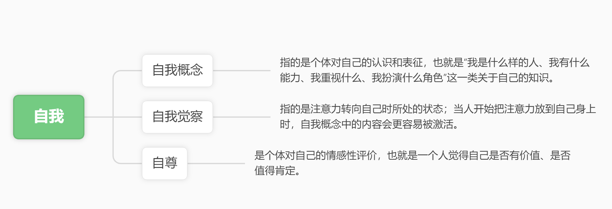
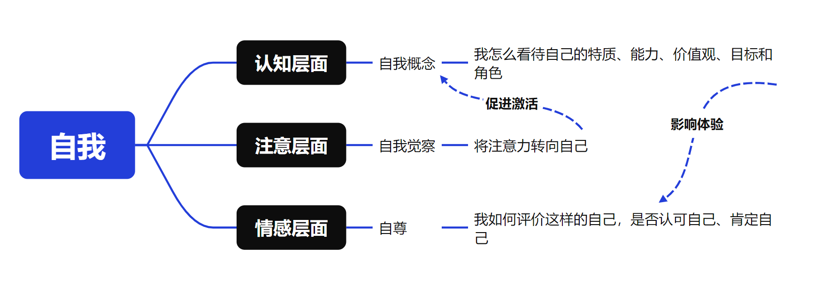

## 一、思维导图之前，先要知道什么叫结构化

思维导图是学习过程中常被提及的一种工具。它的表现形式通常很鲜明：一个中心主题，向外分出若干分支，再继续展开出更细的下位内容。和大段连贯的文字相比，它更简洁，也更直观，于是人们很容易把对思维导图的认识固化为一种印象：只要把知识点按照这样的方式排列出来，一部分内容就算被“理清”了。

这种印象并不难理解。因为从外观上看，思维导图确实比原始材料更清楚。内容被拆开了，层次被摆出来了，页面也显得更有秩序。正因如此，很多学生在使用思维导图时，最先注意到的往往是它的形式：有没有中心词，分支是否完整，层级是否分明，页面是否规整。久而久之，思维导图就很容易被理解成一种“把知识点排整齐”的方法。

但值得进一步思考的是，把知识点排列整齐，到底有什么意义？有人会说，至少这样一来，我就知道这里在讲什么了。可问题在于，知道“这里在讲什么”，本身又意味着什么？在许多大学课程和网课中，教师的讲义和 PPT 往往早就已经做到了这种意义上的“清楚排列”：标题、分点、层级、重点，一应俱全。如果只是为了让内容看起来更清楚，那么在这样的基础上再去做一张思维导图，很多时候不过是把已经排好的东西重新复制一遍。形式变了，内容却没有发生新的组织，学习也未必真正向前推进了一步。

这也提醒我们，思维导图的意义不能只是拿来练习我们按下 Ctrl+C 和 Ctrl+V 的速度。它到底在做什么，为什么它需要被做，才是更值得追问的问题。

如果一张思维导图真的有意义，那么它处理的就不该只是材料表面的排列方式，而应当是知识本身的组织状态。也就是说，它所服务的，不是“把内容换一种样子摆出来”，而是把一部分知识中的内部结构进一步看清。换句话说，思维导图真正相关的问题，不是页面是否更规整了，而是你是否借由它看见了这部分知识围绕什么展开，内部各部分如何联系，又是按怎样的层次组织起来的。

说到底，这就已经不是“怎么画图”的问题了，而是“怎么理解知识”的问题。也正因为如此，在讨论思维导图之前，更需要先弄清楚的，其实是什么叫结构化。

很多学生一听到“结构化”这个词，最先想到的往往仍然是一种形式：标题、编号、分页，或者一层一层展开的树状排列。但这些东西更接近材料的呈现方式，而不是知识真正被理解后的状态。对学习来说，结构化更重要的意思其实是：你能不能从一部分内容里找出它的关键概念，能不能分清这些概念之间的关系，能不能判断哪些是核心，哪些是展开，哪些只是说明和补充。

换句话说，结构化不是把内容排整齐，而是把知识中的概念、关系和层级真正看清。只有到了这一步，一部分内容才不再只是被放在页面上的几段材料，而开始形成一个可以理解、可以调用的整体。也只有在这个前提下，思维导图才可能真正有意义。

## 二、不是每一部分内容都需要思维导图

至于思维导图的滥用，或许可以归结于一个很常见的原因：我们常常把它看成一种适用范围极广的“高级”学习方法。好像一章内容学完之后，必须再用思维导图整理一下，心里才会更踏实；也好像只有做了这一步，学习才算真正完整。它不仅像是一种方法，更像是一种仪式。于是，思维导图很容易被默认成“学完就该做”的固定步骤，而不是一种需要根据任务和内容来判断是否值得使用的工具。

这种心理并不难理解。因为和单纯看书、听课、划重点相比，思维导图看起来更主动，也更有加工感。它给人的印象不是“我只是看了一遍”，而是“我已经进一步整理过了”。也正因为如此，很多学生会天然地觉得，思维导图比普通笔记更高级，比直接背诵更有方法感，比单纯回忆更像是在认真学习。它似乎天然带着一种**“我做了必要事情”**的信号。

但问题恰恰就在这里。一个方法一旦被理解成“高级”，它就很容易脱离具体任务，被过度使用。学生不再先判断：这部分内容到底需不需要额外结构化，我是否已经看清了它的概念、关系和层级；而是默认只要做成思维导图，这部分学习就会更稳、更完整、更有效。方法于是从工具变成了象征，仿佛只要使用了它，学习本身就自动向前推进了一步。

可学习并不是这样发生的。尤其是在许多大学课程和网课里，教师提供的讲义和 PPT 往往已经完成了相当程度的外部组织：标题、分点、层级、重点，很多都已经摆在你面前了。在这种情况下，真正需要先判断的，不是“我做没做思维导图”，而是这部分内容是否还存在一个没有被完成的任务。比如，我是不是还没有真正看清它的概念、关系和层级；我是不是虽然当下看懂了，但之后很难稳定地把这部分结构回忆出来；我是不是需要一个外部支架，帮助自己在复习时迅速定位这部分内容的整体框架。

只有当这些问题确实存在时，思维导图才可能有它的作用。否则，它就只是给已经清楚的材料再加一层整理，把原本可以直接进入记忆、回忆或作答训练的时间，继续消耗在形式加工上。

## 思维导图到底在完成什么？
说到这里，问题才真正转向思维导图本身。既然不是每一部分内容都需要专门做一张导图，那么，当它确实值得被做的时候，它到底在完成什么？

让我来看一个具体的例子：

>在社会心理学里，“自我”并不是一个单一概念。自我概念，指的是个体对自己的认识和表征，也就是“我是什么样的人、我有什么能力、我重视什么、我扮演什么角色”这一类关于自己的知识。自我觉察，指的是注意力转向自己时所处的状态；当人开始把注意力放到自己身上时，自我概念中的内容会更容易被激活。自尊，则是个体对自己的情感性评价，也就是一个人觉得自己是否有价值、是否值得肯定。简单说，自我概念更偏“我怎样看自己”，自我觉察更偏“我此刻是否正在关注自己”，自尊更偏“我对这样的自己感觉如何”。

可见，材料中会连续出现自我概念、自我觉察和自尊这几个概念。单看定义，它们都不难懂：自我概念更接近个体如何认识自己，自我觉察涉及注意力是否转向自己，自尊则更接近个体如何评价自己。问题不在于学生能不能把这几个词认出来，而在于这部分内容最后是怎样被组织起来的。

先看下面这张图。它呈现的其实正是很多学生最常见的处理方式：以“自我”为中心，再向下分出自我概念、自我觉察、自尊几个分支，并在后面接上各自的解释。这样的整理当然不能说没有价值。和原来的连续文字相比，它更分明，也更方便回看。但这种清楚，更多仍然停留在排列上。几个概念被拆开了，却还没有被真正组织起来。为什么是它们被放在一起讨论，它们彼此之间究竟是什么关系，它们只是并列出现，还是分别指向了“自我”的不同方面，这些问题仍然悬在那里。

再看下面这张图，思路就开始变了。同样是这几个概念，这一次的处理不再只是把它们并列摆开，而是进一步区分出了不同层面：自我概念偏向认知，自我觉察偏向注意，自尊偏向情感。到了这里，图中保留下来的就不再只是内容本身，而是对内容所做的判断。几个概念不再只是被放在一起，而是各自被放回了自己的位置。它们为什么会在同一部分中出现，这时候才开始变得清楚。

思维导图的作用，落在两个字上，就是**留痕**。当你已经把一部分知识的结构想清楚了，图的价值就在于把这种判断留在纸面上。这样一来，这部分内容以后再被调动时，你就能看到它原本的组织方式：中心是什么，分支有哪些，哪些内容属于同一层面，哪些内容只是进一步展开。

这也是为什么，思维导图更适合处理整章、整节、整块知识的框架。它能帮你迅速抓回一部分内容的整体面貌，知道自己当时是怎样理解它的，也更容易发现结构上的空缺究竟出在哪里。忘记一章内容时，很多人脑子里只有一种模糊感觉：这里好像讲过一点，那里似乎还有一个分类，但具体忘了什么却说不清。导图的意义，恰恰在于把这种模糊感变成可定位的空白。你能更快看见，自己忘掉的是哪一个分支，哪一层展开，还是哪几个概念之间的连接。

也正因为如此，思维导图最适合放在那些你需要反复回看整体结构的地方。它帮助你保留框架，帮助你在复习时迅速唤起一部分知识的全貌，也帮助你判断接下来应该把力气花在哪里。到了这里，它才真正进入学习过程。

但这件事做到这里，学习仍然没有结束。你可以借导图迅速想起一章内容的大致结构，却未必能立刻写出一个规范定义；你可以知道“自我概念、自我觉察、自尊”分别处在什么位置，却未必已经能把它们的区别与联系组织成一段完整答案。也就是说，导图保住的是框架，考试要求的却往往是更具体的表达、提取和组织。接下来真正需要分开的，是两类任务。

## 四、结构清楚了，为什么还是不会答题

这里真正需要分开的，是两类任务。

第一类，是结构任务。它关心的是：这一章到底在讲什么，这部分知识围绕什么展开，几个概念之间如何联系，哪些是主干，哪些是延伸。前面说的思维导图，主要就是在处理这一层。它帮助你把一部分知识的整体框架抓出来，也帮助你在复习时迅速找回这部分内容的组织方式。

第二类，是考试任务。它关心的已经不再是“这一章大体讲了什么”，而是“你能不能把它准确地写出来、说清楚、用出来”。这时候面对的，往往是更具体的要求：你要写出规范定义，要说明几个概念的区别与联系，要组织一段简答题答案，要在材料里辨认一个概念，要把一个理论放进题目里进行解释。到了这一步，光有框架还远远不够。

还是以前面“自我”这一部分为例。借助思维导图，你当然可以很快看出：自我概念更接近认知层面，自我觉察更接近注意层面，自尊更接近情感层面。这样的结构判断很重要，它能让你不再把这几个概念看成几段孤立的定义，也能让你更清楚它们为什么会被放在一起讨论。但考试面对的往往不是“你有没有看懂这张图”，而是更进一步的问题。比如，自我概念和自尊有什么区别？自我觉察为什么会使自我概念中的内容更容易被激活？如果让你用一段完整的话去解释这三者的联系，你能不能组织出来？这些都已经不是单靠一张导图就能自动完成的了。

也就是说，导图帮助你抓住的是框架，而考试要求你给出的，往往是内容。导图帮助你知道“东西摆在哪”，却不会替你把“东西怎么说清楚”这一步做完。你可以凭借导图迅速想起一章内容的骨架，却仍然需要进一步去练定义、练复述、练比较、练组织答案。否则就会出现一种很常见的情况：看图的时候觉得自己很清楚，一到真正作答，却发现脑子里只有几个位置和方向，具体的话并没有长出来。

这也是为什么，思维导图虽然有价值，却不应该被误解成一种可以包办一切的学习方法。它不能替你进入记忆，也不能替你完成表达。它能做的，是把结构保留下来，让你后面的学习有一个更清楚的依托；但这个依托之后还需要继续被推进，推进到回忆，推进到语言，推进到作答，推进到真正的应用。少了后面的这些步骤，思维导图就很容易停留在“我好像已经理清了”的阶段，而没有真正进入考试要求的层面。

从这个角度看，思维导图在学习中的位置，其实应该放得更准确一些。它更像是一个中间环节，而不是终点。前面是你对知识做出的结构判断，后面是你把这种结构继续转化为记忆、表达和答案的过程。它的作用很明确，但也恰恰因为明确，所以不能被无限放大。

## 五、思维导图应该停在什么位置

说到底，思维导图并不是一种“用了就更高级”的方法，也不是一项“做了才算完整”的学习仪式。它更像是一种有明确适用范围的工具：当一部分知识还缺少结构上的清楚时，它可以帮助你把概念、关系和层级看出来；当一部分知识已经被想明白时，它又可以把这种理解留在纸面上，作为之后回忆和检验的支架。

但也正因为如此，它不应该被放在过高的位置。你不能把一张图当成学习已经完成的证明，也不能把“整理过了”误认为“掌握了”。真正成熟的用法，恰恰是把它放回它该在的位置：它服务于结构，而结构之后，仍然有记忆、回忆、表达和作答等更具体的任务需要完成。

这样看，思维导图的价值其实很清楚。它不负责替你学会，但它可以帮助你更清楚地知道自己正在学什么，已经看清了什么，还有什么没有被真正处理。用得好的时候，它会成为你理解一部分知识的路标；用得不好的时候，它也很容易退化成一种漂亮的整理形式，给人一种学习已经推进的错觉。

所以，真正值得保留下来的，不是“学完一章就画一张图”的习惯，而是这种判断：这部分内容是否真的需要额外结构化？这张图是否真的保留下了我对这部分知识的理解？接下来，我还需要把它推进到哪一步？当这些问题开始被认真地追问时，思维导图才会从一种看上去很有效的方法，变成一件真正能参与学习过程的工具。