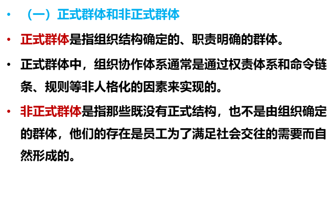

## 一、抄笔记这件事

抄笔记几乎是所有学生都做过的事。上课时记，听讲时记，复习时也记；教材要抄，PPT 要抄，老师补充的话也想一并抄下来。对很多人来说，记笔记几乎已经成了学习开始时最自然的动作。

所以，“抄笔记到底有没有用”这个问题，不能只用一句“有用”或者“没用”来回答。因为笔记这种东西，并不是写下来就自动产生效果的。**它到底有没有帮助，关键不在于你有没有记，而在于你把它记成了什么，又把它用来做了什么。**

如果这个问题不弄清楚，学生就很容易陷入一种常见的误区：一边不停地记，一边默认自己已经在学；可最后留下来的，往往只是越来越厚的笔记，而不是越来越清楚的知识。

## 二、抄笔记在完成......

先把这个问题说清楚很重要。因为只有知道笔记本来在完成什么，才知道它应该怎么记。

一般来说，抄笔记最常完成的，其实不是“让我学会了这个知识点”，而是另外几件事情：

- 它把原本分散在教材、PPT、课堂讲解里的信息先收拢到一起；
- 它帮助我们在信息很多的时候先筛出相对重要的内容；
- 它把一段原本过于完整、过于铺开的材料暂时压缩成一个更容易被再次查看的外部载体。

也就是说，笔记首先完成的，往往是**整理材料、收拢信息、筛选重点和保留记录**。这些事情当然有价值，而且在很多时候确实有必要。尤其是面对信息密度高、老师讲得快、教材又写得很散的时候，如果完全不做任何记录，后面的学习反而会更难推进。

但问题也恰恰在这里。既然笔记首先完成的是这些任务，那它的写法就不应该是对原材料的整段搬运。换句话说，如果一份笔记只是把 PPT 上的一整段话原封不动地抄下来，甚至课堂上来不及写完，还先拍照保存，准备课后再慢慢补抄，那么它完成的仍然主要只是“保存材料”这件事，而不是更高质量地筛选和压缩信息。研究也提示，逐字转录式记笔记更容易停留在浅层加工，而不是把信息用自己的方式重新组织。

所以，真正适合用来做笔记的内容，应该更接近这些东西：  

- 它是一个概念的核心意思；  
- 它是几个关键词之间的关系；  
- 它是后续一看到就能提醒自己展开回忆的提示线索。

从这个意义上说，笔记记得好不好，首先就取决于你有没有把它记成一种**便于后续回顾和使用的压缩材料**，而不是单纯把眼前的内容再誊抄一次。

## 三、整理还远远不够

可是，问题在于，记笔记最常完成的，只是整理；而学习真正关键的几步——**纳入、提取、重组、应用**——它其实都没有自动完成。

这也就意味着，真正值得追问的已经不是“要不要记笔记”，而是：**怎样才能让记笔记这件事，真正变成一种有效的学习方法？**

**第一步，把笔记记成可提取的样子**  
笔记不是教材或 PPT 的副本。正确的做法是，把内容压缩成便于后续提取的结构、关键词和提示线索，而不是逐字抄写整段原文。这样，笔记就可以在未来成为你从记忆中提取信息的线索，而不仅仅是用来看的材料。

这一点听起来并不复杂，但真正落到一页 PPT 上时，很多学生还是会下意识地回到原来的做法：看到屏幕上的定义和解释，就一整段一整段地往笔记本上搬。问题在于，这样写出来的东西看起来很完整，实际上却更像是把材料换了一个地方保存下来，而不是把它压缩成便于后续回忆的形式。

比如上面这一页 PPT，如果让很多学生来记，他们最自然的写法往往会是这样：

>正式群体是指组织结构确定的、职责明确的群体。  正式群体中，组织协作体系通常是通过权责体系和命令链条、规则等非人格化的因素来实现的。  
>非正式群体是指那些既没有正式结构，也不是由组织确定的群体，他们的存在是员工为了满足社会交往的需要而自然形成的。

这样的笔记看上去没有遗漏什么，甚至会让人觉得“记得很全”。但它的问题也很明显：它几乎仍然保持着 PPT 原本的表达方式，真正突出出来的不是知识结构，而是材料原文。你以后再看这份笔记时，很容易还是停留在“重新读一遍”上，而不是根据几个关键点把内容自己提取出来。

更合适的记法，应该先把这一页真正要讲的内容压出来。比如可以记成这样：

**正式群体 vs 非正式群体**
**正式群体**
- 组织结构确定
- 职责明确
- 维持方式：权责体系 / 命令链条 / 规则
**非正式群体**
- 无正式结构
- 非组织规定
- 形成原因：满足社会交往需要，自然形成

这样一来，这页笔记就不再是对原文的誊抄，而是被压缩成了几个之后可以直接拿来回忆的点。你以后看到“正式群体”和“非正式群体”这两个标题，看到下面这些关键词，就应该能够顺着它们把完整意思自己展开，而不是再依赖原来的整段句子。

**第二步，把笔记直接做成提取工具**  
把笔记记成可提取的样子，只是第一步。真正的关键，是让它**从材料整理工具，变成能够主动提取和检验知识的工具**。如果只是写好笔记再翻来翻去，它依旧只是一份材料副本，对学习帮助有限。

一个核心问题是：在笔记上挖空，回忆时如果想不起来怎么办？很多学生的直觉可能是“再去抄一份完整笔记”。但这样做完全没有解决提取的问题，只是把重复整理的过程延长。更有效的方法，是**在第一次记笔记时就把提取机制设计进去**。

以刚才的 PPT 为例：

**正式群体 vs 非正式群体**
**正式群体**
- 组织结构（ ）
- 职责（ ）
- 维持方式：权责体系 / 命令链条 / （ ）
**非正式群体**
- 组织结构（ ）
- 形成方式（ ）
- 形成原因：满足（ ）

在一页笔记的下方或边角写上简短答案，用来快速核对：

> 确定，明确，规则
> 无正式结构，非组织规定，满足社会交往自然形成

回顾时，你先只看主体的空格，尝试自己填充答案；如果暂时想不起来，再对照下方简短答案核对。这样，既不会回到“再抄完整段落”，也能立刻知道哪些点自己记得不牢或理解不准确。

通过这种设计，笔记开始具备**提取工具**的功能：它不仅帮助整理信息，还逼迫自己主动从记忆中提取，并在核对答案的过程中得到即时反馈。

> 核心原则是：笔记主体提供提示和结构，空白用于回忆，答案在页下方或边角供核对。笔记从被动材料，变成主动学习工具。

**第三步，把笔记推向作答训练**  
把笔记做成可提取的工具只是第二步。最终目的，是让笔记不仅帮你回忆，还能帮助你在考试或作业中**真正组织答案**。这一步，重点在于把笔记内容**问题化**，并留出操作空间。

还是以刚才的 PPT 为例：
在你已经挖空、准备好回忆的笔记页上，留出**额外空白区域或背面**，用来自己出题。
根据笔记内容，可以生成问题，比如：

>正式群体的组织结构如何？
>正式群体与非正式群体在职责上有什么区别？
>正式群体维持方式包括哪些？
>非正式群体是如何形成的？
>总结正式群体与非正式群体的主要区别。

出题时尽量覆盖不同类型考察点：定义、区别、特征、作用、分类等。

回顾时，你可以先尝试**自己回答这些问题**，再对照笔记下方或边角的简短答案检查。这样一来，笔记不再只是回忆的工具，而直接变成了**训练作答能力的工具**。

>核心原则是：一节课的笔记写完后，必须留出空间，让自己为自己出题并尝试作答。只有这样，笔记才真正进入学习循环，既可以回忆，也可以训练组织答案和表达。

通过这一步，整条流程就形成了一个连续环：

**笔记先记成可提取的样子 → 挖空回忆与核对 → 问题化作答**

学生通过这个循环，可以从被动记录材料，逐步过渡到主动提取、检验和作答，真正把笔记变成一个服务于学习的工具，而不是单纯的书面记录。

## 所以，笔记有用吗？

我想，到了这里，答案已经显而易见了：笔记本身并不是学习的终点，而是学习的起点。它的真正价值，不在于你写了多少字、整理得多么整齐，而在于它能否被你用来回忆、检验、重组，并最终在作答或实际应用中派上用场。

笔记最初的用处，是**收拢信息、筛选重点、压缩材料、保留记录**。如果止步于此，它完成的事情远远不够：你整理了材料，却未必记住、未必能提取、未必能重组，更未必能在作答或实际应用中运用。

而真正有用的笔记，是在经过连续三个步骤后形成的：

1. **先记成可提取的样子**：压缩信息、保留结构、关键词和提示线索。
    
2. **再变成提取工具**：挖空、回忆、核对，形成回忆—检查循环。
    
3. **推向作答训练**：问题化改写，留出空间自测，模拟考试或作答场景。

我要向你发出一个倡议：从现在起，不要再机械地抄写和整理笔记。每一次记笔记，都要主动思考：**我能否用它回忆内容？我能否用它检验自己？我能否用它组织答案？** 把笔记从材料记录改造成提取和作答工具，让它真正成为你学习的助推器，而不仅仅是桌面上的文字堆积。

让每一页笔记，都成为你主动学习的起点、检验学习的工具、练习表达的舞台。行动起来，从下一页笔记开始，让学习真正发生。